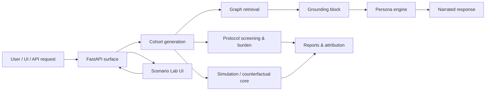

# Architecture

## Purpose
Synthetic Patient Persona is a grounded conversational patient simulation platform for trial design, protocol stress testing, and patient-journey exploration. The system is deliberately split into a deterministic simulation core and a narration layer so that decisions are replayable while the spoken response can still feel human.

This is a design and stakeholder-simulation tool, not medical advice, not regulatory evidence, and not a statistical virtual control arm.

## System Principles
1. The deterministic core decides what happens.
2. The language model narrates how it feels after the fact.
3. Every heuristic is tracked in the assumption ledger.
4. Every simulation path must work offline.
5. Grounding must come from graph-native retrieval, not free-form guesswork.

## High-Level Flow

## Core Layers

### 1. Schemas and Assumptions
- `src/spp/schemas/patient_dna.py` defines the canonical persona profile.
- `src/spp/assumptions.py` and `src/spp/foundation/ledger.py` hold every heuristic, coefficient, and threshold that influences outcomes.
- The ledger exists so outputs can be audited, sensitivity-tested, and labeled as judgment or evidence.

### 2. Cohort Generation
- `src/spp/cohort/epidemiology.py` supplies condition priors.
- `src/spp/cohort/packs.py` loads and validates prior packs.
- `src/spp/cohort/correlation.py` handles latent correlation structure.
- `src/spp/cohort/generator.py` builds seeded cohorts.
- `src/spp/cohort/residency.py` caches resident cohorts for the Scenario Lab preview path.
- `src/spp/cohort/traits.py` derives goals, constraints, and barriers from the schema and priors.

### 3. Protocol and Burden
- `src/spp/protocol/eligibility.py` parses criteria safely and screens personas against inclusion and exclusion rules.
- `src/spp/protocol/lenient.py` supports editor-style live preview where half-typed rules produce diagnostics instead of hard failure.
- `src/spp/protocol/burden.py` estimates participation burden and ranks eligible personas by risk.
- `src/spp/protocol/attribution.py` computes eligibility attribution, including the sole-reason view.

### 4. Simulation Core
- `src/spp/foundation/rng.py` creates named random scopes so draws are stable by identity, not by ordering.
- `src/spp/foundation/events.py` and `src/spp/foundation/store.py` support event sourcing and persistence.
- `src/spp/simulation/schedule.py` builds visit schedules from protocol burden.
- `src/spp/simulation/hazard.py` models dropout and retention.
- `src/spp/simulation/timeline.py` and `src/spp/simulation/survival.py` transform event logs into curves and summaries.
- `src/spp/simulation/counterfactual.py` forks a scenario, applies a change, and compares the paired runs.
- `src/spp/simulation/sensitivity.py` perturbs assumptions and re-runs the paired simulation.

### 5. Knowledge and Grounding
- `src/spp/knowledge/ontology.py` and `src/spp/knowledge/graph.py` define the owned knowledge substrate.
- `src/spp/knowledge/retrieval.py` performs deterministic retrieval and ranking.
- `src/spp/graph/client.py` wraps Neo4j and degrades to offline stubs when live graph access is unavailable.
- `src/spp/graph/schema.py` is the single source of truth for graph labels, edge types, and metaedges.
- `src/spp/graphrag/retriever.py` orchestrates the retrieval pipeline.
- `src/spp/graphrag/grounding.py` builds grounding blocks with citations.
- `src/spp/graphrag/cypher_guard.py` validates LLM-authored Cypher before execution.

### 6. Narration
- `src/spp/persona/engine.py` turns persona context and grounding into a response.
- `src/spp/persona/prompts.py` defines the prompt templates.
- `src/spp/narration/prompt.py` assembles the narration prompt.
- `src/spp/narration/cassette.py` records and replays narration when available.
- `src/spp/narration/citations.py` enforces citation validity.
- `src/spp/narration/structured.py` decodes structured outputs.
- `src/spp/narration/interview.py`, `panel.py`, and `room.py` cover interview, focus-group, and interview-room workflows.
- `src/spp/narration/evaluation.py` and `bundle.py` support compliance evaluation and evidence bundles.

### 7. Reporting
- `src/spp/report/compare.py` compares cohorts.
- `src/spp/report/diffwalk.py` powers flip-table traversal.
- `src/spp/report/html.py` renders standalone HTML artifacts.
- `src/spp/report/studio.py` backs the cohort studio and marginal comparison views.
- `src/spp/simulation/report.py` assembles simulation artifacts.

### 8. API Surface
`src/spp/api/main.py` is the public entry point. The main routes are:
- `/health`
- `/persona/interview`
- `/cohort/generate`
- `/protocol/stress-test`
- `/simulation/run`
- `/counterfactual/run`
- `/counterfactual/report`
- `/scenario/preview`
- `/scenario/residency`
- `/room/session`
- `/room/ask`
- `/room/fact/{fact_id}`
- `/studio/marginals`
- `/studio/diff`
- `/assumptions`
- `/protocol/fields`
- `/panel/run`
- `/persona/narrate`

## Runtime Modes

### Offline Mode
Offline mode is the default. LLM calls and graph access degrade to deterministic stubs so the full pipeline can run without external services.

### Live Mode
Live mode is enabled when `SPP_LIVE=true` and the required credentials and graph services are available. In that mode the graph client, retrieval pipeline, and narration components can use real external dependencies.

## Front End
The `ui/` package is a Vite + React + TypeScript Scenario Lab.
- It previews eligibility as the user types.
- It keeps the last clean result visible when the current rule text is invalid.
- It synchronizes the URL so the current state is shareable and reproducible.
- It proxies API calls to the Python backend during development.

Relevant files:
- `ui/src/App.tsx`
- `ui/src/lib/preview.ts`
- `ui/src/lib/urlState.ts`
- `ui/src/components/*`
- `ui/e2e/*`

## Data and Artifacts
- `data/prior_packs/*.json` are the condition priors.
- `data/knowledge/core.json` is the owned knowledge graph substrate.
- `tests/golden/*` stores committed outputs for pinned behavior.
- `tests/eval/*` stores narration and retrieval evaluation inputs.
- `tests/fixtures/*` stores shared JSON fixtures.
- `ui/src/types/artifacts.ts` is generated from exported schemas.

## Operational Rules
- Never call `random` directly in simulation code; always use seeded scopes.
- Never hide a heuristic outside the ledger.
- Never let the narration layer mutate simulation state.
- Never make grounding depend on a model behaving correctly.
- Keep the offline path healthy even when live services are absent.

## Validation Surface
The repository is validated across several layers:
- `pytest` for the Python core.
- `ui` Vitest tests for the Scenario Lab components and preview behavior.
- Playwright E2E tests for the three killer interactions.
- Golden tests for byte-stable outputs.
- Contract tests for prior-pack and distribution invariants.

## Where To Start
If you need to understand a behavior or change it safely, start here:
1. `src/spp/api/main.py` for public entry points.
2. `src/spp/schemas/patient_dna.py` for the canonical data model.
3. `src/spp/cohort/generator.py` and `src/spp/protocol/eligibility.py` for core decisions.
4. `src/spp/simulation/` for retention and counterfactuals.
5. `src/spp/narration/` for grounded speech and evidence handling.
